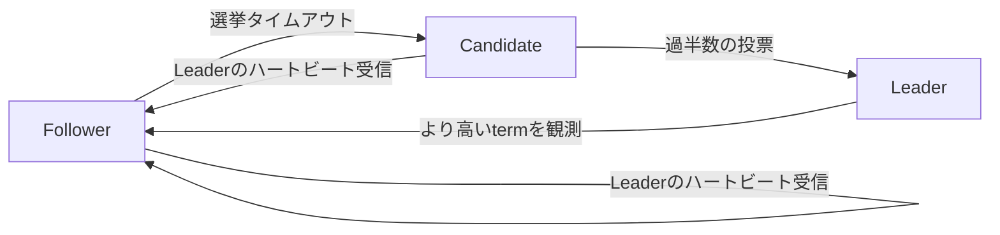
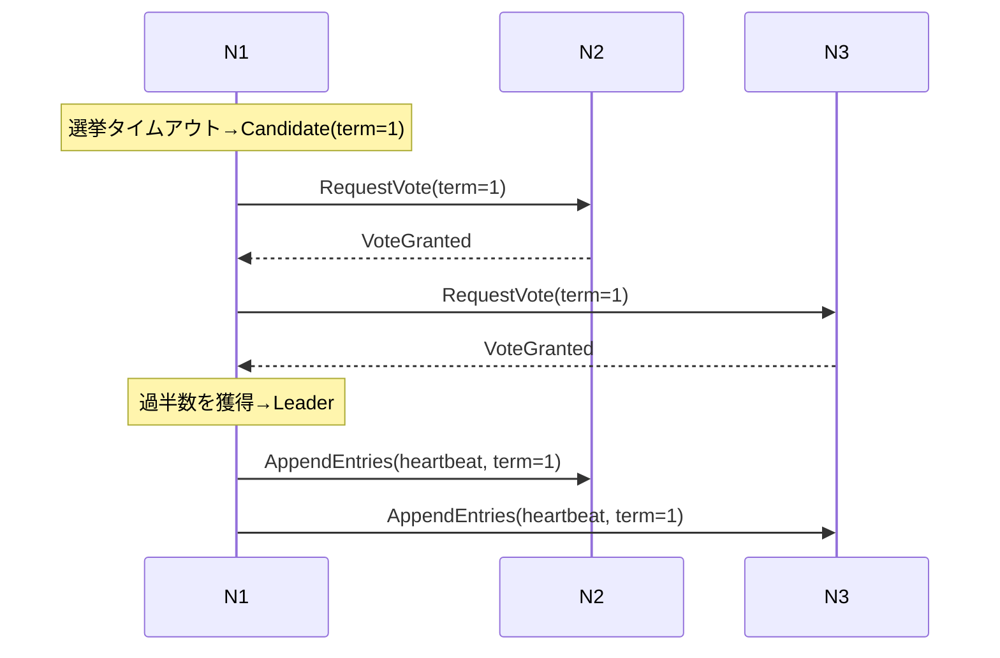
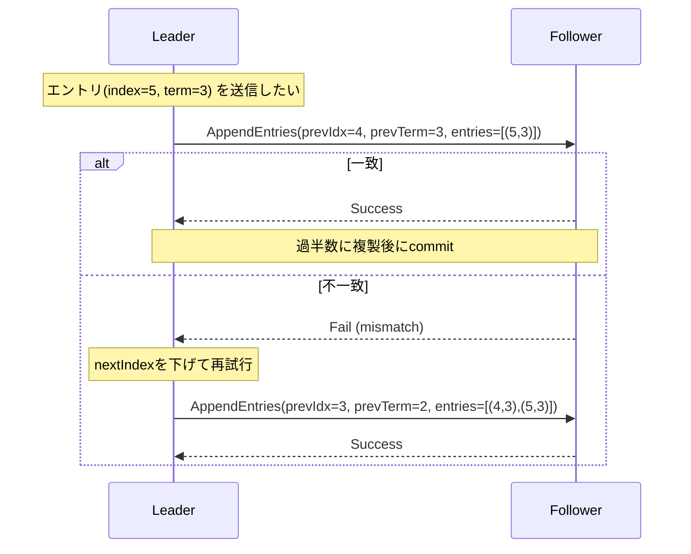

# go_visualize_raft

Go で動作するシンプルな Raft 可視化デモです。擬似的な Raft のやり取り（リーダ選出・ハートビート）を生成し、Mermaid のシーケンス図としてブラウザに表示します。

## 概要
- 小規模な擬似クラスタ（例: 5 ノード）で選挙とハートビートのメッセージ列を生成
- 生成したメッセージを Mermaid の sequenceDiagram で可視化
- ブラウザから「Run Simulation」「Reset」を実行可能（学習・デモ用途）

## 必要要件
- Go 1.22 以上
- インターネット接続（Mermaid を CDN から読み込み）

## セットアップと実行
```bash
cd go_visualize_raft
go run .
# ブラウザで http://localhost:8088 を開く
```

## 使い方
- 画面上部のボタン
  - Run Simulation: 擬似的な選挙→リーダ確定→ハートビート送信（1 セット）
  - Reset: ノード状態とイベント履歴を初期化
- 右上に現在のイベント件数（記録されたメッセージ数）が表示されます。
- 下部のシーケンス図は、最新のメッセージ列に基づき自動再描画されます。

## エンドポイント一覧
- `/`            : UI（Mermaid によるシーケンス図と操作ボタン）
- `/sequence`    : Mermaid テキスト（デバッグ用）
- `/events`      : イベント JSON（`from`, `to`, `msg`, `at`）
- `/simulate`    : シミュレーション実行（POST）
- `/reset`       : 初期化（POST）

## ディレクトリ構成（最小）
```
go_visualize_raft/
├─ main.go        # HTTP サーバ、イベント生成、Mermaid テキスト生成
└─ go.mod         # Go モジュール
```

## 注意事項
- 本リポジトリは擬似実装です。実運用のコンセンサス要件（ログ整合、コミット判定、フォーク回復、ネットワーク分断処理など）を満たすものではありません。
- 可視化は学習・説明を目的としています。正確な動作検証には実装ライブラリ（例: hashicorp/raft など）をご利用ください。

## トラブルシューティング
- 図が表示されない: ブラウザのキャッシュを更新（Ctrl+F5）。コンソールエラーを確認。
- ポート競合: 既に :8088 を使用しているプロセスがある場合は停止、またはポート番号をコード内で変更してください。
- Go 依存: `go mod tidy` を一度実行してください。

## 発展アイデア
- ログ複製（index/term）の整合過程や commit 遷移の段階的可視化
- ネットワーク遅延・分断・メッセージロスのシナリオ追加
- タイムライン/フローチャートなどの補助図
- 実装ライブラリ（例: hashicorp/raft）からのイベントフック連携

## Raft のアルゴリズム（技術的詳細）
- 役割とタイムアウト
  - follower は選挙タイムアウトで candidate に昇格し、RequestVote をブロードキャスト
  - 過半数の投票を得ると leader になり、AppendEntries（ハートビート）を定期送信
- 投票ポリシー（ログの新しさ）
  - 候補者の (lastLogTerm, lastLogIndex) が投票者のログより「新しい」場合のみ投票
  - これにより新しいログを持つノードが leader になりやすく、Leader Completeness を満たしやすい
- ログ複製と整合
  - AppendEntries は prevLogIndex/prevLogTerm を持ち、follower 側で不一致なら拒否
  - leader は nextIndex を下げて再送し、差分を徐々に埋めて整合化
  - 過半数にレプリケートされたエントリは commit となり、状態機械に適用（同インデックスの一意性を保証）
- 任期（term）の単調増加と安全性
  - すべての RPC は term を含み、受信側は自身より高い term を見たら追従（follower に降格）
  - State Machine Safety: 全ノードで「同じ index には同じコマンドのみ」を適用
- 可用性と分断
  - クォーラム（過半数）未満のパーティションは leader を選出できず、新規書き込み不可（安全性優先）

## 参考文献
- Diego Ongaro, John Ousterhout. "In Search of an Understandable Consensus Algorithm (Raft)." USENIX ATC 2014.
- Ongaro の博士論文: "Consensus: Bridging Theory and Practice" (2014)
- HashiCorp Raft 実装（Go）: `github.com/hashicorp/raft`

---

## 図（Mermaid）

### 状態遷移（Raft 役割）



### 選挙のシーケンス（例）



### ログ複製と整合（prevLogIndex/prevLogTerm）



---

## 表（要約）

| 項目 | 説明 | 主なフィールド/条件 |
|------|------|----------------------|
| RequestVote | 候補者が投票を依頼 | term, candidateId, lastLogIndex/lastLogTerm（新しさ判定）|
| AppendEntries | ログの複製/ハートビート | term, leaderId, prevLogIndex/prevLogTerm, entries, leaderCommit |
| 過半数 | 投票/複製の承認しきい値 | N台中 ⌊N/2⌋+1 |
| commit | エントリの適用許可 | 過半数へレプリケート完了 |
| 安全性 | 同一indexに同一コマンド | Leader Completeness, State Machine Safety |
